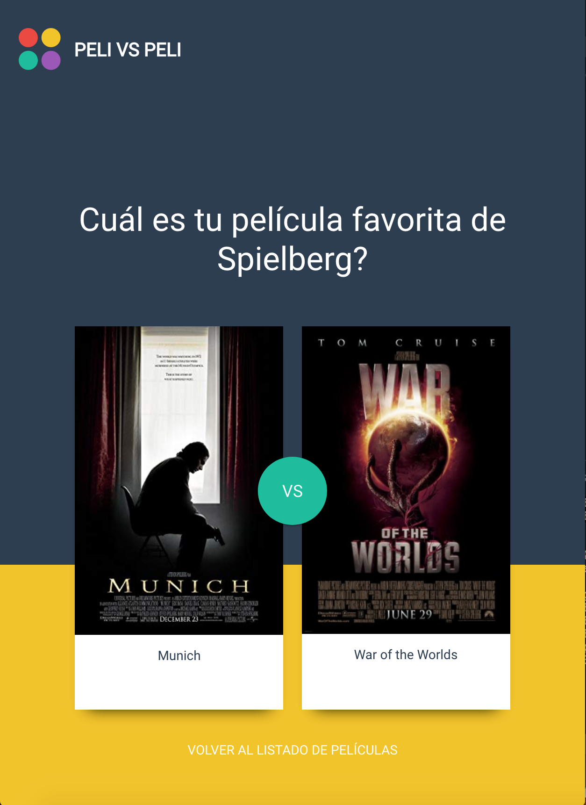
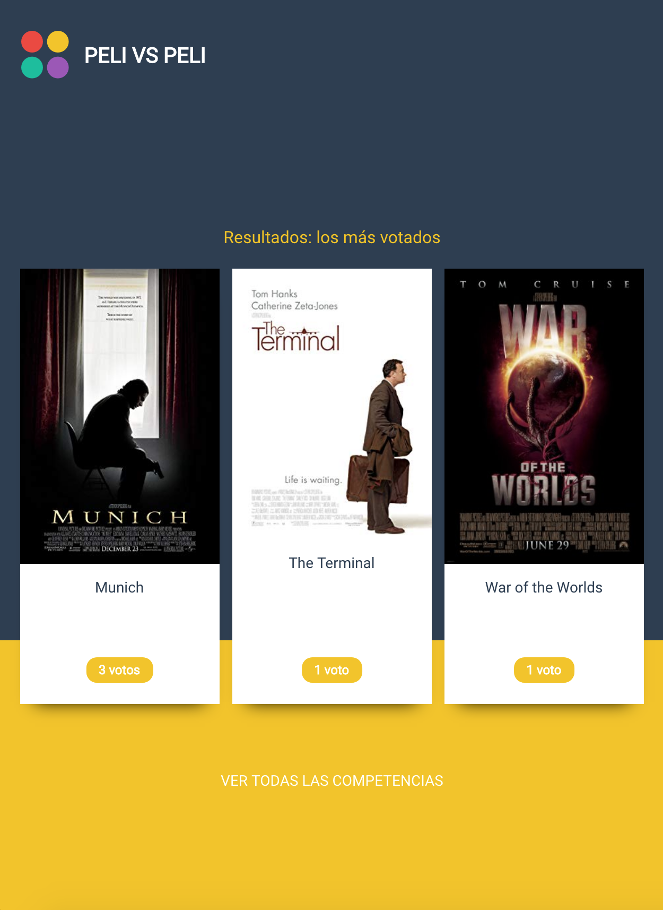

Simple project to create competitions between movies in which users vote their favorites and see afterwards which were the most voted ones. Frontend done by someone else, backend done by me. This is part of a project to finish a Full Stack dev course.

